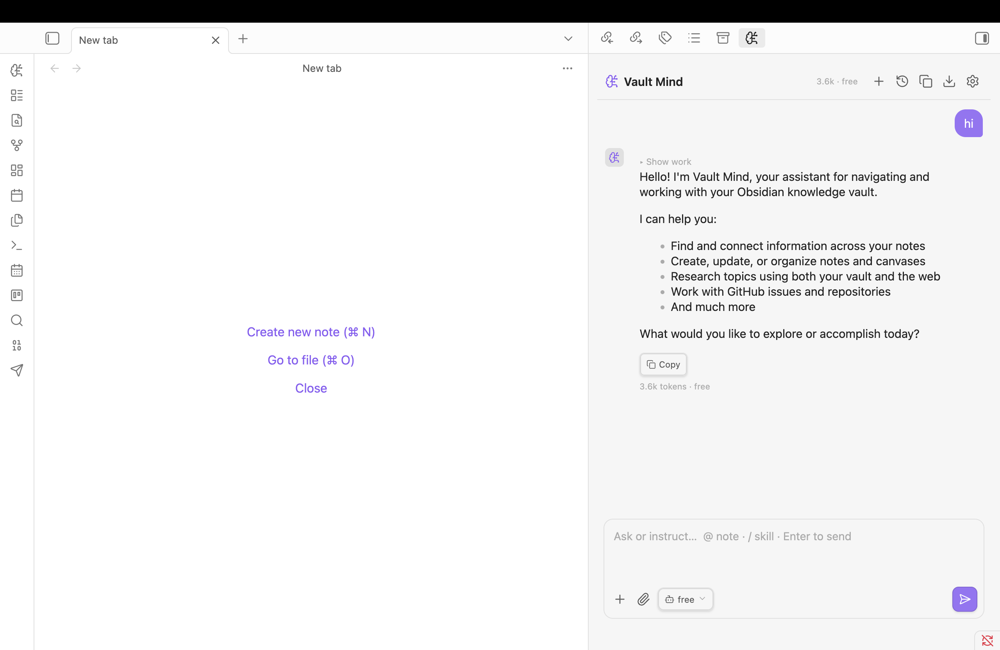

# Vault Mind

An autonomous AI agent embedded in your [Obsidian](https://obsidian.md) vault. It plans, searches, traverses links, reads notes, processes files, and answers with citations — grounded in your actual knowledge graph, not the model's guesses.

Powered exclusively by [OpenRouter](https://openrouter.ai). Deposit a $10 credit to unlock 1,000 free requests/day across all free model variants — no separate API keys needed.

> Desktop only. All your notes stay local — only model API calls leave your machine.

## Demo



*The agent searches your vault, reads notes, and returns grounded answers with `[1]` citations and expandable tool traces showing every step.*

## Key Features

- **Hybrid Graph Retrieval** — Combines BM25 keywords, local ONNX vector embeddings, and link graph traversal.
- **File & Attachment Support** — Ingests and processes files alongside your standard Markdown notes.
- **User-Defined Skills** — Store custom prompts, specialized macros, or instructions as regular vault notes that the agent can read and execute as repeatable skills.
- **Deep Research Sub-loop** — Spawns a dedicated sub-agent to break complex research into sub-questions, scrape web data, and compile cited Markdown reports.
- **Vault mutations** — create, update, move, delete notes and canvases (destructive actions confirmed by you), with one-click undo.
- **Web browsing** — search the internet and read pages for external context.
- **Long-term memory** — remembers durable facts, decisions, and preferences across sessions.
- **Token + cost tracking** — real API consumption per message and per session.

## Install (manual)

1. Download `main.js`, `manifest.json`, and `styles.css` from the [latest release](../../releases/latest).
2. Copy them into `<your-vault>/.obsidian/plugins/vault-mind/`.
3. Reload Obsidian → Settings → Community Plugins → enable **Vault Mind**.

## Setup

Vault Mind uses **only OpenRouter** — no separate OpenAI, Anthropic, or Google API keys required.

1. Create a free account at [openrouter.ai](https://openrouter.ai) and generate an API key at [openrouter.ai/keys](https://openrouter.ai/keys).
2. Add a minimum of **$10 credit** to your balance. This permanently upgrades your account tier, unlocking a pool of **1,000 free requests per day** on free models (IDs ending in `:free`) instead of the standard 50/day limit.
3. Open **Vault Mind** settings inside Obsidian → paste your API key.
4. Pick a model. Tool-capable models are sorted first in the picker for the best agentic experience.
5. (Optional) Add a GitHub token to enable the GitHub repository connector.

Your key and settings are stored locally in `data.json` inside your plugin folder. They are strictly private and never leave your machine.

## Build from source

```bash
git clone <this-repo>
cd vault-mind
npm install
npm run build      # type-check + production bundle -> main.js
# or: npm run dev   # watch mode
```

Then copy `main.js`, `manifest.json`, `styles.css` into your vault's plugin folder (or symlink the repo there during development).

## Tech stack

TypeScript · esbuild · Obsidian Plugin API · OpenRouter (SSE streaming + tool-calling) · MiniSearch · `@xenova/transformers` (local embeddings) · graph traversal via Obsidian `resolvedLinks`. No external server.

## Contributing

PRs welcome. Copy `data.json.example` → `data.json` is **not** needed — Obsidian generates `data.json` on first run. Never commit `data.json` (it holds your API key and chat history).

## License

[MIT](LICENSE) © Shariar Faisal
